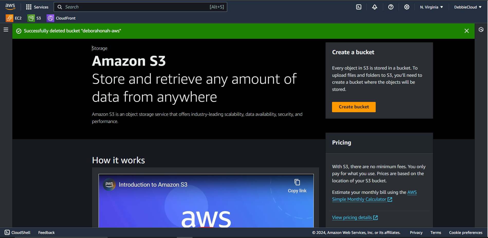
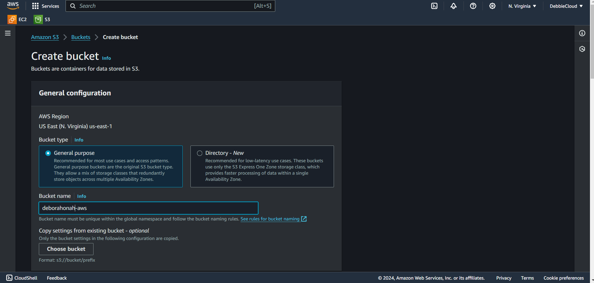
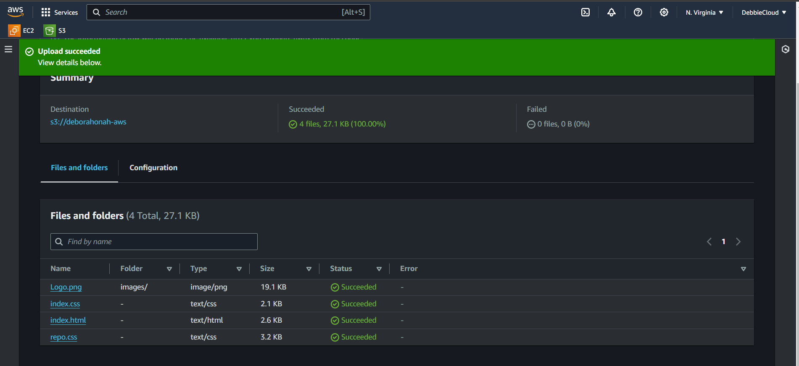
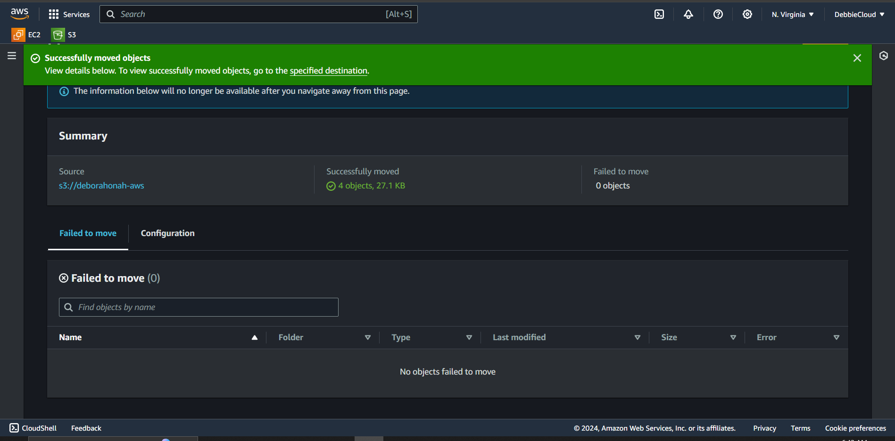
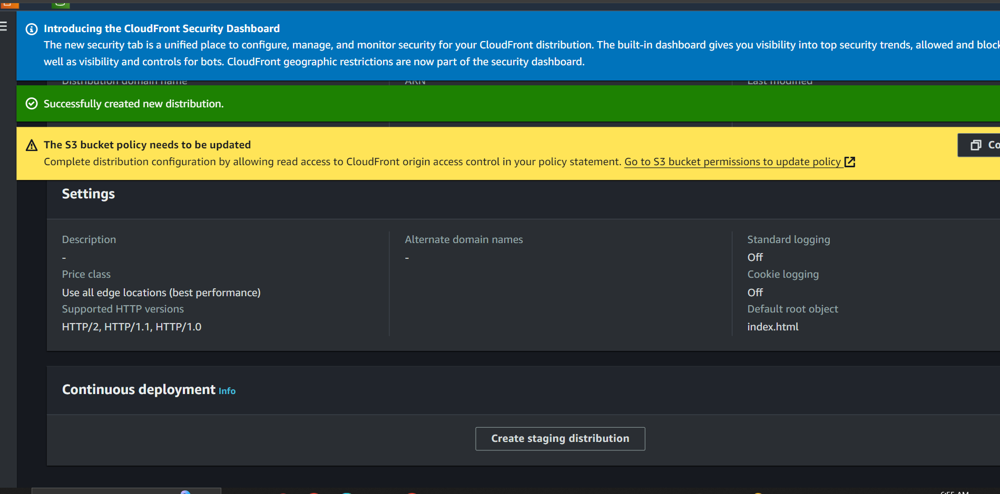
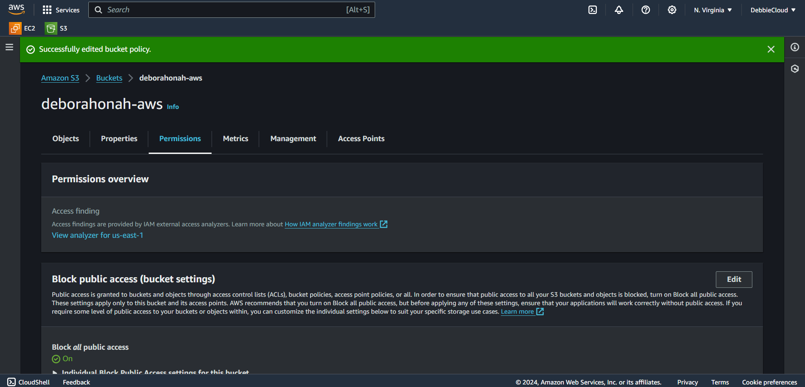

# Objective

**Create a static website and host it on S3 bucket(private bucket) but with public read policy assigned, using cloud front for CDN. With a screenshot of your Aws account bearing your name. Input your steps and screenshots in your README file on GitHub**

A Screenshot of my Aws account bearing my name "Debbiecloud"

To create a static website, logging into your Aws console and search for s3, click on it. On the s3 dashboard, click on "Create Bucket" and enter a bucket name. Leave all other settings intact and click on "Create Bucket" on the button of the page.

Uploade website file on the s3 bucket by clicking on the bucket name, then click on upload button to upload some files, on the file upload page, click on "Add file" or "Add folder" leave all other settings intact and scroll to the button of the page and click on "Upload"

Now, to copy the files into the default bucket root location, click on "Name" at the top left and then click on "Action" at the top right, it would bring down a drop options click on "Move" scroll down a littel choose "browse" click on "Bucket" scroll down click on "choose location" scroll down and click on "Move". You have successfully moved all your files. 

When you go back and click on your bucket, you would find out everything is now in the root directory of the s3 bucket.

The next thing to do now is search for "CloudFront" click on "Create Distribution" --> Origin (Your s3 bucket name should pop up) scroll down and select "Origin access control settings" then click on "Create new OAC" leave the default settings and click on "Create" scroll down and "Enable security protection" scroll down to "Default root protection" and input "index.html" go ahead and click on "Create Distribution". Now copy the policy and paste inside your s3 bucket policy.

Go back to your s3 bucket, click on "Permission" then "Edit" bucket policy, paste and save.

On your CloudFront, click on your cloud distribution you created, you will see a (Domain Name System) DNS that has been assigned, copy and paste it on your browser, you should have your bucket content run successfully. Thank you.

readme.md